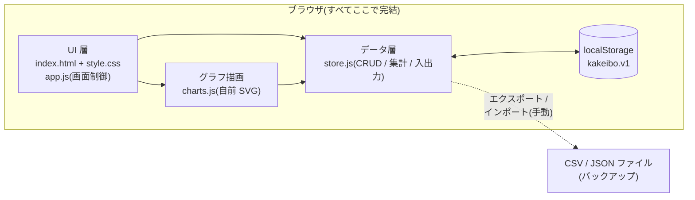
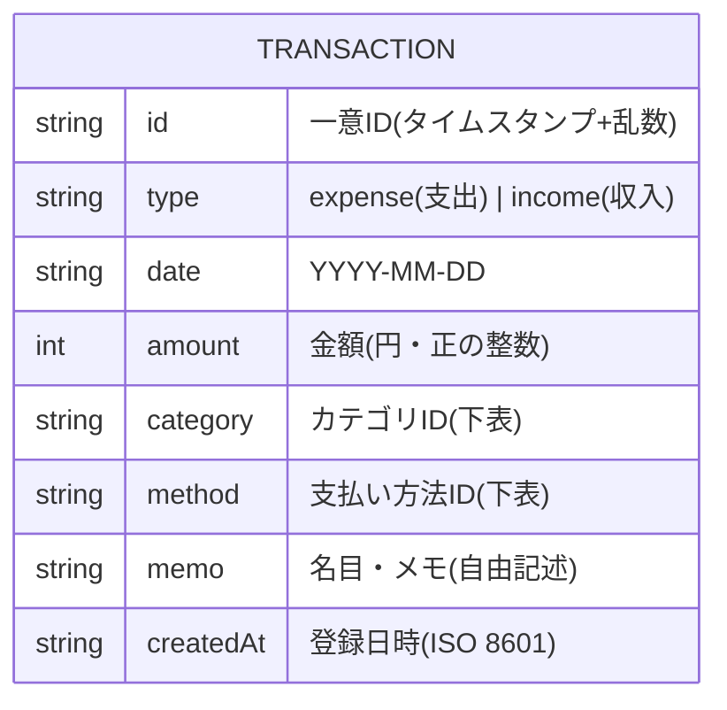
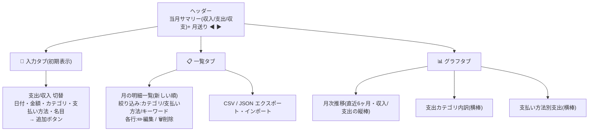
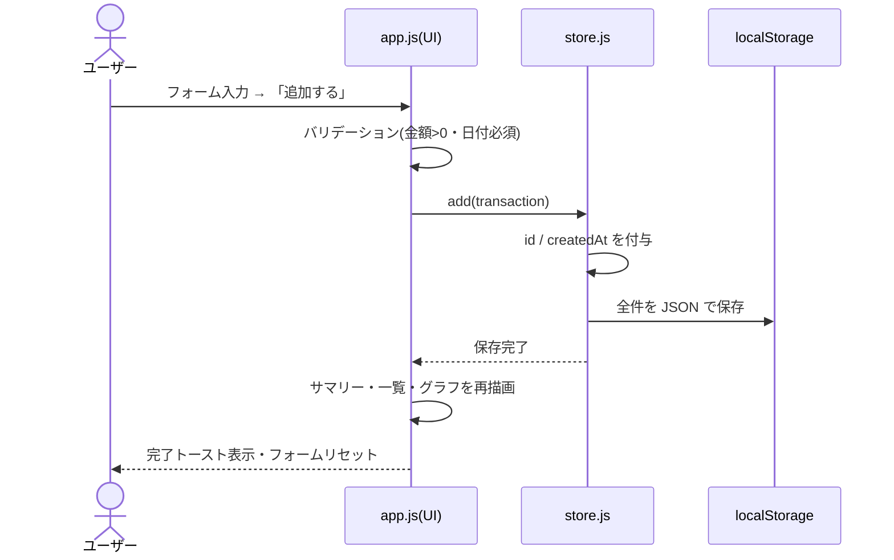

# 家計簿アプリ 設計書

要件は [01_requirements.md](./01_requirements.md) を参照。

## 全体アーキテクチャ

サーバーを持たない、ブラウザ内で完結する構成。データがブラウザの外へ出るのは
ユーザーが明示的にエクスポートしたときだけ。



| ファイル | 役割 |
|---|---|
| `index.html` | 画面の骨格(3タブ+フォーム+一覧+グラフ) |
| `css/style.css` | スタイル。ライト/ダーク両テーマ |
| `js/store.js` | 明細の CRUD・月別集計・CSV/JSON 入出力・localStorage 永続化 |
| `js/charts.js` | SVG グラフ描画(棒グラフ・横棒グラフ)+ ツールチップ |
| `js/app.js` | タブ切替・フォーム制御・一覧描画・イベント配線 |

## データモデル

明細(Transaction)1種類だけの極めて単純なモデル。



### localStorage スキーマ

```jsonc
// key: "kakeibo.v1"
{
  "schemaVersion": 1,
  "transactions": [
    {
      "id": "1720300000000-x7k2",
      "type": "expense",
      "date": "2026-07-07",
      "amount": 1280,
      "category": "food",
      "method": "paypay",
      "memo": "スーパーで食材",
      "createdAt": "2026-07-07T12:34:56.000Z"
    }
  ]
}
```

`schemaVersion` を持たせ、将来スキーマを変える場合は読み込み時にマイグレーションする。

### カテゴリ / 支払い方法の定義(ID ⇔ 表示名)

| 種別 | ID → 表示名 |
|---|---|
| 支出カテゴリ | food→食費, daily→日用品, transport→交通費, housing→住居, utility→水道光熱, comm→通信, medical→医療・健康, social→交際費, hobby→趣味・娯楽, clothing→衣服・美容, other→その他 |
| 収入カテゴリ | salary→給与, bonus→賞与, side→副業, extra→臨時収入, other_income→その他 |
| 支払い方法 | cash→現金, credit→クレジットカード, suica→Suica, paypay→PayPay, bank→銀行口座, other→その他 |

## 画面設計

### 画面遷移(タブ構成)



### 画面ラフ(ワイヤーフレーム)

```
┌──────────────────────────────────────────┐
│  かけいぼ            ◀  2026年7月  ▶      │
│  ┌─────────┬─────────┬─────────┐         │
│  │ 収入     │ 支出     │ 収支     │         │
│  │ ¥280,000│ ¥123,456│ +¥156,544│        │
│  └─────────┴─────────┴─────────┘         │
│  [ 📝 入力 ] [ 📋 一覧 ] [ 📊 グラフ ]     │
├──────────────────────────────────────────┤
│  (入力タブ)                               │
│   ( 支出 | 収入 )  ← セグメント切替        │
│   日付      [2026-07-07]                  │
│   金額      [        1280] 円             │
│   カテゴリ  [食費 ▼]                       │
│   支払い方法 [PayPay ▼]                    │
│   名目      [スーパーで食材        ]        │
│            [ 追加する ]                    │
└──────────────────────────────────────────┘
```

### 記録追加のシーケンス



## グラフ設計

外部ライブラリを使わず SVG を自前描画する。設計は次の原則に従う:

- **月次推移**: 収入・支出の2系列の縦棒グラフ。系列色は固定
  (収入=青 `#2a78d6` / 支出=赤 `#e34948`、ダークでは明度調整)。
  2系列なので凡例を常設。棒は最大24px幅・上端4px角丸・隣接棒間に2pxの余白
- **カテゴリ内訳 / 支払い方法内訳**: 金額の大小比較が目的なので
  **単色(青)の横棒**で降順に並べる。単一系列なので凡例なし、
  各棒の先端に金額を直接表示
- 値はグラフ上の直接ラベル+ホバー時のツールチップの両方で提示し、
  色が判別できなくても読めるようにする
- 軸・グリッド線は1pxのヘアライン・控えめなグレー。テキストは系列色を使わない

## セキュリティ / プライバシー

- 外部通信ゼロ(CSP 相当の考え方で、外部リソース参照を一切書かない)
- メモ等のユーザー入力は DOM へ `textContent` で挿入し、innerHTML への
  文字列連結はしない(XSS 防止)
- インポート時は JSON / CSV をバリデーションし、不正な行はスキップして件数を報告
