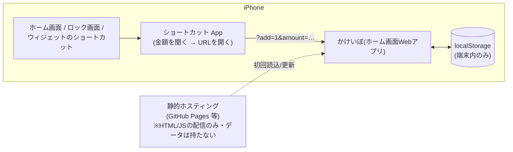

# iPhone で使う(PWA+ショートカット連携)

「かけいぼ」を iPhone のホーム画面に**アプリとして**追加し、さらにホーム画面・ロック画面・
ウィジェット領域から**2タップで支出を記録できる**ようにする手順。

## 仕組みの全体像

iOS のウィジェットには入力フォームを直接置けない(テキスト入力不可)ため、
**PWA(ホーム画面Webアプリ)+ ショートカットのクイック入力URL** で同等の体験を作る。



**プライバシーは変わらない**: ホスティングは HTML/JS ファイルを配るだけで、
家計データは今までどおり端末の localStorage から一歩も出ない。

## セットアップ

### 1. HTTPS で配信する(初回のみ)

PWA として動かすには HTTPS 配信が必要(`file://` では不可)。一番手軽なのは GitHub Pages:

1. リポジトリの **Settings → Pages → Source** を **「GitHub Actions」** に設定
2. main ブランチに push すると `.github/workflows/pages.yml` が自動デプロイ
   (初回は Actions タブから `Deploy to GitHub Pages` を手動実行してもよい)
3. `https://<ユーザー名>.github.io/calc_app/` で開けるようになる

> リポジトリが Private の場合、GitHub Pages の利用には有料プランが必要。
> 無料で済ませたい場合は Cloudflare Pages / Netlify 等の静的ホスティングでも同じ
> (このリポジトリをそのまま繋ぐだけ。ビルド設定は不要)。

### 2. ホーム画面に追加する

1. iPhone の **Safari** で上記 URL を開く
2. 共有ボタン(□↑)→ **「ホーム画面に追加」**
3. 以後はホーム画面の「かけいぼ」アイコンから全画面のアプリとして起動する
   - オフラインでも起動できる(Service Worker がアプリ本体をキャッシュ)
   - ホーム画面Webアプリのデータは Safari の「7日間未使用でデータ削除」ルールの対象外
   - それでも端末故障に備えて、ときどき CSV/JSON エクスポートでバックアップ推奨

## クイック入力URL(ショートカット連携)

URL パラメータで明細を登録できる。ショートカットや他アプリからの連携用。

`https://<配信URL>/index.html?add=1&amount=500&category=food&method=paypay&memo=カフェ`

| パラメータ | 必須 | 内容 |
|---|---|---|
| `add` | ✓ | クイック入力モードの目印(値は何でもよい。`add=1` 推奨) |
| `amount` | - | 金額(円・整数)。**あり→その場で登録**、**なし→フォームに事前入力して金額欄にフォーカス** |
| `type` | - | `expense`(既定)/ `income` |
| `category` | - | カテゴリID(`food` / `transport` など。[02_design.md](./02_design.md) の表参照)。不明なIDは「その他」扱い |
| `method` | - | 支払い方法ID(`cash` / `credit` / `suica` / `paypay` / `bank` / `other`)。省略時「その他」 |
| `memo` | - | 名目(URLエンコード) |
| `date` | - | `YYYY-MM-DD`(省略時は今日) |

登録後はクエリを消去するので、リロードしても二重登録されない。

## ショートカットの作り方(例:「コンビニ支出を2タップ記録」)

1. **ショートカット** App → 「+」で新規ショートカット
2. アクション **「入力を要求」** を追加 → 種類を **数字**、プロンプトを「いくら使った?」に
3. アクション **「URLを開く」** を追加し、URL に以下を設定(`[入力を要求]` は変数を挿入):

   ```
   https://<配信URL>/index.html?add=1&amount=[入力を要求]&category=food&method=paypay&memo=コンビニ
   ```

4. 名前を「コンビニ支出」などにして保存

### 置き場所(お好みで)

- **ホーム画面**: ショートカットの詳細 → 「ホーム画面に追加」→ 1タップで金額入力が出る
- **ウィジェット**: ホーム画面長押し → 「ショートカット」ウィジェットを追加 → よく使う記録ボタンを並べる
- **ロック画面**: 設定 → 壁紙 → ロック画面のウィジェットに「ショートカット」を追加
- **背面タップ**: 設定 → アクセシビリティ → タッチ → 背面タップ にショートカットを割り当てると、
  iPhone の背面を2回叩くだけで入力が立ち上がる

パターン違い(交通費・昼食など)はショートカットを複製して `category` / `method` / `memo` を
変えるだけ。金額まで固定したい場合(毎朝のコーヒー ¥180 など)は「入力を要求」を外して
`amount=180` を直接 URL に書けば **完全1タップ登録** になる。

## 制約・既知の注意点

- ウィジェットから開くと一瞬 Safari(アプリ)への画面遷移が挟まる(iOSの仕様)
- ホーム画面Webアプリと Safari は localStorage が**別領域**。
  日常利用はどちらか一方に統一する(移行はエクスポート→インポートで可能)
- 本物の WidgetKit ウィジェット(当月サマリー常時表示など)が欲しくなったら、
  次の段階として Capacitor によるネイティブ化を検討([03_brushup_log.md](./03_brushup_log.md) の今後の候補参照)
